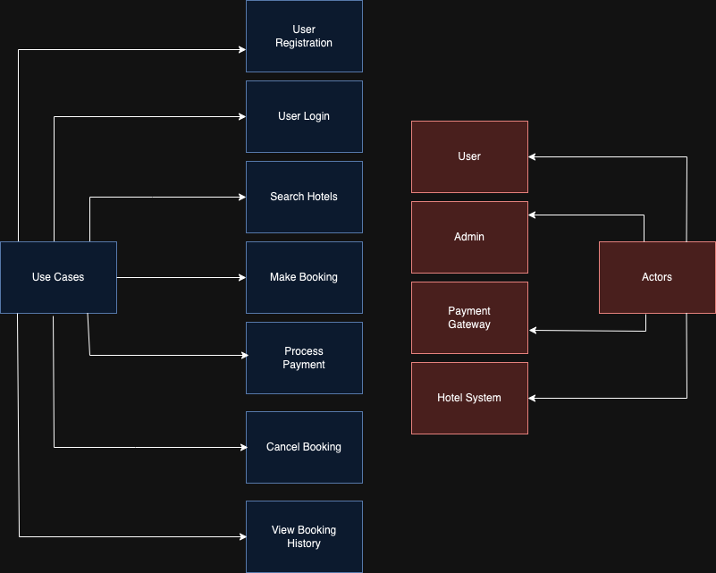

# Requirement Analysis in Software Development

## Introduction
This repository is dedicated to exploring **Requirement Analysis**, a critical phase in the Software Development Lifecycle (SDLC).  
It aims to provide a structured understanding of how requirements are gathered, analyzed, documented, and validated to ensure successful project delivery.  

### Purpose
- To serve as a knowledge base for learning and applying Requirement Analysis techniques.
- To document best practices, methodologies, and tools used in the process.
- To provide examples and templates for conducting Requirement Analysis effectively.
---------------------------------------------

## What is Requirement Analysis?

Requirement Analysis is a critical phase in the Software Development Lifecycle (SDLC) where the project team gathers, analyzes, and defines the requirements for the software system to be developed. This process ensures that all stakeholders have a shared understanding of what the system should do and how it should perform.

### Importance in the SDLC:
1. **Clarity and Understanding**: It helps bridge the gap between stakeholders' expectations and the technical team’s understanding, reducing ambiguity and potential misunderstandings.
2. **Scope Definition**: Clearly defines the scope of the project to avoid scope creep, ensuring that the project stays on track and within budget.
3. **Foundation for Design and Development**: Acts as the blueprint for subsequent phases, such as system design, coding, and testing.
4. **Cost and Time Efficiency**: Enables accurate estimation of project cost, timeline, and resource allocation, minimizing rework and delays.
5. **Quality Assurance**: By thoroughly understanding and documenting requirements, the final product is more likely to meet user expectations, resulting in higher customer satisfaction.

### Key Activities in Requirement Analysis:
- **Requirement Gathering**: Collecting stakeholders' needs and expectations through techniques like interviews, surveys, and workshops.
- **Requirement Elicitation**: Refining and elaborating gathered requirements using brainstorming, focus groups, and prototyping.
- **Requirement Documentation**: Structuring the requirements in formal documents, such as requirement specification documents, user stories, and use cases.
- **Requirement Analysis and Modeling**: Prioritizing, validating, and visualizing requirements through modeling techniques like flowcharts and data flow diagrams.
- **Requirement Validation**: Ensuring that the documented requirements are accurate, complete, and align with stakeholder expectations.

By thoroughly conducting Requirement Analysis, teams can mitigate risks, enhance collaboration, and ensure the successful delivery of software that aligns with stakeholder needs.

-----------------------------------------------

## Why is Requirement Analysis Important?

Requirement Analysis plays a vital role in the Software Development Lifecycle (SDLC) as it lays the foundation for the entire project. It ensures that all stakeholders are aligned and that the software meets business goals and user expectations. Here are three key reasons why Requirement Analysis is critical:

### 1. **Clarity and Understanding**
Requirement Analysis helps eliminate ambiguity by clearly defining what the system should do. By involving stakeholders early, it bridges the gap between their expectations and the technical team's understanding, reducing misunderstandings and misaligned objectives.

### 2. **Prevention of Scope Creep**
By defining the scope of the project upfront, Requirement Analysis minimizes the risk of scope creep—uncontrolled changes or expansions in project requirements. This helps keep the project on track, within budget, and aligned with its timeline.

### 3. **Improved Project Planning and Execution**
Thoroughly analyzed and documented requirements provide a solid basis for planning and execution. Accurate requirements enable precise estimation of time, cost, and resources, ensuring efficient allocation and reducing the chances of project delays or overruns.

### 4. **Enhanced Product Quality**
Requirement Analysis ensures that the end product aligns with the stakeholders' needs and expectations. By validating and refining requirements, teams can deliver a high-quality product that meets functional and non-functional criteria, leading to greater customer satisfaction.

### 5. **Risk Mitigation**
Identifying and analyzing requirements early helps uncover potential risks and challenges. Addressing these risks at the beginning of the project minimizes costly errors and rework during later stages of development.

By understanding the significance of Requirement Analysis, teams can ensure a smoother development process, better collaboration, and successful delivery of software solutions.

------------------------------------------------------------

## Key Activities in Requirement Analysis

Requirement Analysis involves a series of structured activities to ensure all requirements are accurately gathered, analyzed, and validated. Below are the five key activities involved:

### 1. **Requirement Gathering**
- Collecting initial requirements from stakeholders using various techniques such as:
  - **Interviews:** Direct discussions with stakeholders to understand their needs.
  - **Surveys/Questionnaires:** Distributing forms to gather input from a wider audience.
  - **Workshops:** Conducting group sessions to discuss and collect requirements.
  - **Observation:** Watching users in their work environment to understand real-world needs.
  - **Document Analysis:** Reviewing existing documentation to understand the current system.

### 2. **Requirement Elicitation**
- Refining and elaborating on gathered requirements by:
  - **Brainstorming:** Generating ideas and solutions collaboratively with stakeholders.
  - **Focus Groups:** Conducting in-depth discussions with a select group of stakeholders.
  - **Prototyping:** Creating preliminary models or mockups to visualize and refine requirements.

### 3. **Requirement Documentation**
- Recording requirements in a clear and organized manner through:
  - **Requirement Specification Documents:** Detailed documents listing all functional and non-functional requirements.
  - **User Stories:** Short descriptions of system functionalities from a user's perspective.
  - **Use Cases:** Diagrams and narratives showing user interactions with the system.

### 4. **Requirement Analysis and Modeling**
- Analyzing and structuring the requirements using:
  - **Requirement Prioritization:** Ranking requirements based on importance and impact.
  - **Feasibility Analysis:** Evaluating the technical, financial, and time feasibility of requirements.
  - **Modeling:** Using visual tools like data flow diagrams, entity-relationship diagrams, and workflow charts to represent and analyze requirements.

### 5. **Requirement Validation**
- Ensuring that the documented requirements are complete, accurate, and feasible by:
  - **Review and Approval:** Sharing requirements with stakeholders for feedback and confirmation.
  - **Acceptance Criteria Definition:** Establishing specific conditions for requirement completion.
  - **Traceability:** Creating matrices to ensure all requirements are addressed in development and testing.

By following these key activities, Requirement Analysis ensures that the final product aligns with stakeholder expectations and project objectives.
------------------------------------------------------------
------------------------------------------------------------
## Key Activities in Requirement Analysis

Requirement Analysis involves a series of structured activities to ensure all requirements are accurately gathered, analyzed, and validated. Below are the five key activities involved:

### 1. **Requirement Gathering**
- Collecting initial requirements from stakeholders using various techniques such as:
  - **Interviews:** Direct discussions with stakeholders to understand their needs.
  - **Surveys/Questionnaires:** Distributing forms to gather input from a wider audience.
  - **Workshops:** Conducting group sessions to discuss and collect requirements.
  - **Observation:** Watching users in their work environment to understand real-world needs.
  - **Document Analysis:** Reviewing existing documentation to understand the current system.

### 2. **Requirement Elicitation**
- Refining and elaborating on gathered requirements by:
  - **Brainstorming:** Generating ideas and solutions collaboratively with stakeholders.
  - **Focus Groups:** Conducting in-depth discussions with a select group of stakeholders.
  - **Prototyping:** Creating preliminary models or mockups to visualize and refine requirements.

### 3. **Requirement Documentation**
- Recording requirements in a clear and organized manner through:
  - **Requirement Specification Documents:** Detailed documents listing all functional and non-functional requirements.
  - **User Stories:** Short descriptions of system functionalities from a user's perspective.
  - **Use Cases:** Diagrams and narratives showing user interactions with the system.

### 4. **Requirement Analysis and Modeling**
- Analyzing and structuring the requirements using:
  - **Requirement Prioritization:** Ranking requirements based on importance and impact.
  - **Feasibility Analysis:** Evaluating the technical, financial, and time feasibility of requirements.
  - **Modeling:** Using visual tools like data flow diagrams, entity-relationship diagrams, and workflow charts to represent and analyze requirements.

### 5. **Requirement Validation**
- Ensuring that the documented requirements are complete, accurate, and feasible by:
  - **Review and Approval:** Sharing requirements with stakeholders for feedback and confirmation.
  - **Acceptance Criteria Definition:** Establishing specific conditions for requirement completion.
  - **Traceability:** Creating matrices to ensure all requirements are addressed in development and testing.

By following these key activities, Requirement Analysis ensures that the final product aligns with stakeholder expectations and project objectives.

------------------------------------------------------------
------------------------------------------------------------
# Types of Requirements

In the context of the **Booking Management Project**, requirements are categorized into **Functional Requirements** and **Non-functional Requirements**.

## Functional Requirements

Functional requirements define the specific behavior, functionality, or operations of the system. These are the "what" of the system.

- **User Registration**: Users should be able to create an account with personal details and login credentials.
  
- **User Authentication**: Secure login and registration process for users.

- **Property Listing**: Display hotels with key details such as price, images, and other relevant information.

- **Search Functionality**: 
  - **CDN App**: Display nearby hotels, recommendations, offers, etc.
  - **User App**: Users should be able to search for a hotel and book it.

- **Booking Functionality**: 
  - Users should be able to create, update, view, and cancel bookings.

- **Payment Functionality**: The system must process payments securely through a payment gateway.

- **User Notifications**: Users should receive notifications within the app.

## Non-Functional Requirements

Non-functional requirements describe the system’s performance, security, scalability, usability, and reliability. These are the "how" of the system.

- **Performance**:
  - A CDN ensures faster loading times by delivering content from servers closest to the user.
  - Use a master-slave architecture to reduce load on the database.

- **Scalability**:
  - CDNs handle high traffic by distributing the load across multiple servers.
  - The system should be able to scale horizontally to handle increased traffic.

- **Security**:
  - CDNs protect against DDoS attacks and improve secure delivery of content.
  - Ensure data encryption, secure login, and protection against common vulnerabilities.

- **Usability**:
  - The application should have an intuitive UI/UX, making it easy for users to navigate and perform tasks.

- **Reliability**:
  - The system should have an uptime of 99.9% and recover quickly from any failures.

---------------------------------------
---------------------------------------
# Use Case Diagrams

## What are Use Case Diagrams?

Use Case Diagrams are a visual representation of the system's functionality from an end-user perspective. They illustrate the interactions between actors (users or other systems) and the system itself to achieve specific goals or tasks. 

These diagrams help in understanding and visualizing how users will interact with the system, and are crucial for Requirement Analysis as they provide a clear overview of the system's expected behavior.

### Benefits of Use Case Diagrams:
- **Clarity**: They offer a simple, clear visualization of system functionality and interactions.
- **Communication**: Help stakeholders, including developers, business analysts, and users, understand system features.
- **Documentation**: Serve as a reference for further design, development, and testing activities.
- **Scope Definition**: Aid in identifying system boundaries and ensuring that all user requirements are captured.

## Use Case Diagram for the Booking System

Below is the Use Case Diagram for the Booking System, which depicts the interactions between various actors (users, system components) and key use cases such as user registration, hotel search, booking, and payment.

